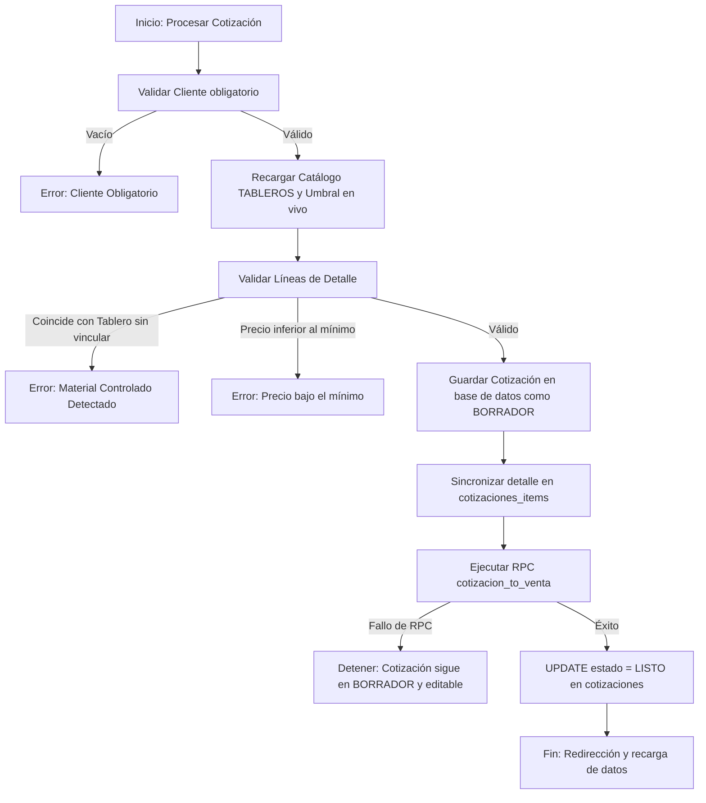

# Interfaz: Cotizaciones

**Ruta:** `/cotizaciones` · **Componente:** `frontend/src/pages/CotizacionesPage.tsx`  
**Origen de datos:** Cliente de Supabase directo (acceso directo a tablas y ejecución de RPCs).

---

## 1. Propósito y Alcance

La interfaz de **Cotizaciones** es el punto de inicio comercial del ERP. Permite a los vendedores crear, editar, duplicar, imprimir y procesar cotizaciones y comprobantes de venta (Boletas, Facturas y Tickets). 

Su propósito central es la formalización de la oferta comercial y el aseguramiento del control de precios mínimos y materiales controlados, culminando en la generación automática de la cabecera y el detalle de la venta correspondiente mediante la transición segura al estado `LISTO`.

---

## 2. Conceptos y Arquitectura Lógica

### A. Ciclo de Vida de la Cotización
Una cotización transiciona por los siguientes estados:
*   **`BORRADOR`**: Estado editable e incremental. Se pueden modificar descripciones, cantidades, precios, adelantos, notas y clientes en cualquier momento.
*   **`LISTO`**: Estado procesado y finalizado. Al pasar a `LISTO`, la cotización se bloquea y queda en modo **solo lectura**. Únicamente es posible actualizar el **N° de Comprobante** (a menos que esté explícitamente bloqueado desde Tesorería) o duplicar el documento completo como un nuevo borrador.
*   **`ELIMINADO`**: Borrado lógico (anulado) que retira la cotización de los listados activos de ventas y analítica, preservando la auditoría de datos en la base.

### B. Tipos de Documento e IGV
El sistema soporta cuatro tipos internos: `COTIZACION`, `BOLETA`, `FACTURA` y `TICKET`. Los tipos de comprobante de venta (`BOLETA`, `FACTURA`, `TICKET`) calculan automáticamente el IGV del 18% (`IGV_RATE = 0.18`) sobre el valor neto (subtotal menos descuento), mientras que el tipo puramente informativo `COTIZACION` calcula el valor total directamente sin desglose de IGV.

### C. Cliente "Público General"
Si un vendedor digita un nombre que no se encuentra en la base de datos de contactos, el sistema almacena internamente el nombre con el prefijo `PÚBLICO GENERAL (<nombre>)`. Al mostrarse en la UI, una función auxiliar `stripPublicoGeneral` remueve este prefijo de forma dinámica para una visualización premium y limpia en la grilla y el editor.

### D. Optimización Avanzada del Rendimiento
Para evitar el lag en la interfaz debido a renders masivos en el formulario del editor de cotizaciones, se implementa una arquitectura desacoplada de alto rendimiento:
*   **`CellInput`**: Componente de input memoizado (`React.memo`) que mantiene un estado local inmediato para un tipeo fluido sin interferir con el cursor y sincroniza con el estado global mediante un **debounce de 80 ms** o en el evento `onBlur`.
*   **`SearchInput` y `UnitSelect`**: Elementos memoizados nativos que reducen a cero los renderizados innecesarios en grillas complejas.
*   **Pre-cálculo de Coincidencias (`itemMatchesMap`)**: Un hook `useMemo` centraliza y almacena en caché las búsquedas de coincidencias difusas de materiales controlados. Esto evita recalcular y ejecutar el algoritmo de similitud en cada renderizado de celda.

---

## 3. Tablas y Objetos de Base de Datos

| Objeto | Descripción | Acceso y Sincronización |
|---|---|---|
| `cotizaciones` | Tabla cabecera: totales calculados, datos de facturación de cliente y llaves de vinculación (`venta_id`, `optimization_id`). | Lectura/Escritura directa vía cliente de Supabase. |
| `cotizaciones_items` | Detalle estructurado de cada línea (cantidad, unidad, descripción, precio unitario, total). | Sincronización en caliente al guardar vía función `syncItemsTable` (eliminación e inserción por lotes). |
| `cotizaciones_audit_log` | Auditoría de modificaciones de número de comprobante. | Registro automático en la base de datos. |
| `catalog_products` | Catálogo de materiales controlados (SKU `TAB%`) y precios mínimos de venta. | Monitoreo Realtime y consulta directa previa al guardado. |
| `contacts` | Directorio de clientes (`type = 'CLIENT'`) con DOI/RUC para autocompletado inteligente. | Autocompletado directo y vinculación de datos. |
| `app_settings` | Configuración avanzada (clave `similarity_threshold`) para la detección inteligente de materiales. | Leída al inicializar y recargada en vivo al guardar. |
| **RPC `cotizacion_to_venta`** | Procedimiento SQL que crea o sincroniza la venta en `ventas_cabecera` y `ventas_detalle`. | Ejecución atómica exclusiva al cambiar a `LISTO`. |

---

## 4. Flujo de Validación y Procesamiento Atómico (LISTO)

Cuando el usuario confirma que desea procesar una cotización (transicionando de `BORRADOR` a `LISTO`), se ejecuta un flujo estrictamente atómico diseñado para garantizar la integridad financiera de la base de datos:

### Detalle del Flujo de Resguardo:
1.  **Persistencia del borrador**: Se guardan todos los cambios físicos en el cliente Supabase pero manteniendo la cotización en estado `BORRADOR`.
2.  **Llamada a la RPC**: Se invoca a la función Postgres `cotizacion_to_venta(id)`. 
3.  **Transacción Segura**: 
    *   Si la RPC falla (por ejemplo, por fallas de conexión o restricciones de base de datos), la cotización **sigue siendo un borrador y se mantiene completamente editable**, lo que permite corregir cualquier discrepancia o reintentar el proceso.
    *   Si la RPC se ejecuta correctamente (creando/actualizando la venta en `ventas_cabecera` e insertando sus líneas correspondientes en `ventas_detalle`), el frontend procede a marcar la cotización como `LISTO` en la base de datos de manera definitiva.

---

## 5. Control de Permisos y Roles
*   **Rol Comercial (`ventas`)**: Solo tiene permiso para visualizar y gestionar sus **propias** cotizaciones creadas. La función `fetchData` inyecta automáticamente el filtro `user_id` del usuario autenticado en la consulta de Supabase.
*   **Roles de Dirección y Tesorería (`administrador`, `admin`, `asistente_admin`)**: Tienen acceso global, permitiéndoles visualizar el listado completo de cotizaciones del ERP.
*   **Protección de Rutas**: La ruta `/cotizaciones` está permitida para los roles comerciales y de dirección en `ROLE_ALLOWED_PATHS`.

---

## 6. Notas de Comportamiento y Robustez Operativa
*   **El Adelanto Informativo**: El adelanto es registrado por el vendedor con fines meramente descriptivos. No fluye automáticamente como saldo pagado en la cabecera de la venta, ya que es el asistente administrativo en la interfaz de Tesorería quien debe verificar los extractos bancarios o recibir el dinero en efectivo, registrando el cobro formal para amortizar el saldo.
*   **Cruce con Base de Datos Segura**: La función SQL en la base de datos protege los cobros ya realizados. Si se vuelve a procesar una cotización editada que ya tiene una venta y cobros acumulados, la fórmula preserva el saldo cobrado recalculando:
    `saldo_pendiente = GREATEST(nuevo_total - (monto_total_anterior - saldo_pendiente_anterior), 0)`.
*   **Bloqueo de Modificación**: Una vez que Tesorería confirma un comprobante vinculándole un voucher de sustento físico, la cotización queda bloqueada en vivo (`comprobante_locked: true`), impidiendo cualquier modificación del N° de Comprobante incluso en modo administrador.
