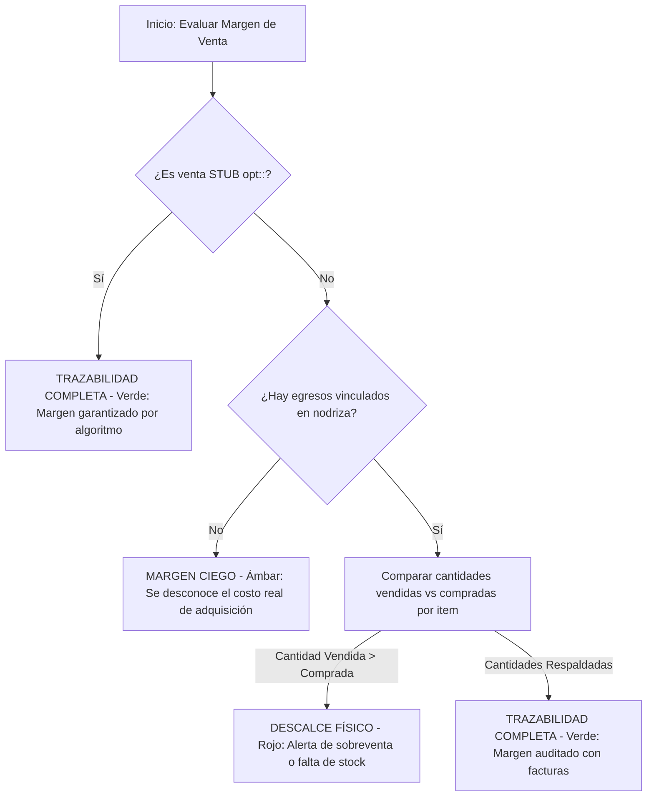

# Interfaz: Gestión de Ventas y Tesorería

**Ruta:** `/sales-treasury` · **Componente:** `frontend/src/pages/SalesTreasuryPage.tsx`  
**Origen de datos:** Cliente de Supabase directo (funciones y consultas directas en `frontend/src/services/api.ts`).

---

## 1. Propósito y Alcance

La interfaz de **Gestión de Ventas y Tesorería** actúa como la consola financiera central del ERP. Su objetivo es la administración de las ventas activas y egresos, el control y la conciliación de cobros, las transferencias internas entre cuentas financieras, la gestión de órdenes de pago, y el análisis de la trazabilidad y margen real de cada venta mediante el cruce de materiales comprados y vendidos.

---

## 2. Pestañas de Gestión

La interfaz agrupa la gestión financiera en tres pestañas principales controladas mediante el estado `viewMode`:
1.  **Ventas**: Monitoreo de todas las ventas activas generadas desde cotizaciones. Permite realizar cobros (`DepositModal`), ver el historial de abonos y margen de trazabilidad, y asociar comprobantes oficiales.
2.  **Egresos**: Registro y control de compras de materiales e insumos, asignación de facturas físicas (`InvoiceAssignmentModal`) y egresos generales de caja (`ExpenseModal`).
3.  **Requerimientos**: Visualización y amortización de las órdenes de pago de movilidad, mano de obra y adicionales aprobadas desde el módulo de Solicitudes (`PayOrderModal`).

---

## 3. Cuentas Financieras y Cálculo en Caliente

### A. Cuentas Monitoreadas
El ERP gestiona los siguientes flujos de dinero distribuidos en cuentas bancarias y de caja chica:
*   **`Efectivo`**: Caja física disponible en planta.
*   **`2049/YAPE`**: Monedero digital móvil.
*   **`4071`**: Cuenta corriente operativa principal.
*   **`9001`**: Cuenta corriente secundaria.
*   **`8059`**: Cuenta recaudadora o custodia.

### B. Consolidado en Tiempo Real (Cliente)
Los KPIs financieros del encabezado se calculan dinámicamente en el navegador en una sola iteración sobre el total de movimientos de la tabla `nodriza_tesoreria` (Libro Mayor):
*   **Efectivo Disponible**: Saldo neto acumulado exclusivo de la cuenta `Efectivo`.
*   **Fondos en Cuentas**: Suma neta acumulada en las cuentas bancarias (`2049/YAPE`, `4071`, `9001`, `8059`).
*   **Patrimonio en Tesorería**: Suma de Efectivo Disponible + Fondos en Cuentas.

La lógica de acumulación por registro en caliente opera bajo el siguiente criterio:
$$\text{Saldo Cuenta} = \sum (\text{Movimientos de INGRESO o TRANSFERENCIA en Cuenta Destino}) - \sum (\text{Movimientos de EGRESO o TRANSFERENCIA en Cuenta Origen})$$

---

## 4. Tablas y Estructuras de Datos Relacionadas

| Objeto / Tabla | Propósito | Operaciones del Módulo |
|---|---|---|
| `ventas_cabecera` | Registro maestro de la venta (montos totales, saldos pendientes, estado de pago). | Recarga Realtime automatizada por suscripción a eventos de inserción/actualización. |
| `ventas_detalle` | Detalle físico de insumos y servicios vendidos (derivados de la cotización). | Consulta por demanda al expandir el detalle de una fila en la grilla. |
| `nodriza_tesoreria` | Historial general de transacciones financieras (kardex) del sistema. | Registro de abonos, egresos de caja y transferencias entre cuentas. |
| `cotizaciones_items` | Detalle de los ítems de cotización, utilizado para comparar con compras asociadas. | Lectura directa en el cálculo de margen por insumo. |
| `ordenes_pago` | Requerimientos de egreso listos para desembolso comercial. | Liquidación de pago directo en la pestaña "Requerimientos". |
| Storage `vouchers` | Bucket de Supabase que almacena sustentos en formato PDF o imagen. | Carga mediante la API `uploadVoucher` con nombres normalizados de archivo. |

---

## 5. Trazabilidad de Margen (Cruce Inteligente)

Para garantizar que el área comercial cotice con márgenes de ganancia reales respaldados físicamente por compras en almacén, la interfaz calcula la **trazabilidad de margen** de cada venta comparando las descripciones y cantidades vendidas (`cotizaciones_items`) contra las compras físicas cargadas en egresos (`invoice_details`):

### Clasificación Visual en UI:
*   🟢 **TRAZABILIDAD COMPLETA (Verde)**: Todos los productos vendidos cuentan con sus correspondientes facturas de compra asociadas que respaldan la cantidad entregada.
*   🟡 **MARGEN CIEGO (Ámbar)**: La venta no tiene facturas de egreso vinculadas. El costo de los materiales no ha sido auditado.
*   🔴 **DESCALCE FÍSICO (Rojo)**: La cantidad vendida de un insumo es mayor que la cantidad registrada en las compras asociadas en la base de datos de egresos. Requiere atención inmediata.

---

## 6. Flujo de Confirmación de Comprobantes de Pago
El asistente administrativo puede asociar un comprobante real (`BOLETA`, `FACTURA` o `TICKET`) a una venta mediante el modal de confirmación:
1.  **Sustento Físico**: Carga una imagen o PDF del voucher/comprobante oficial.
2.  **Carga en Storage**: El frontend sube el documento al bucket `vouchers` de Supabase con la nomenclatura `${codigo_cotizacion}_SUSTENTO`.
3.  **Llamada a la API**: Invoca a `api.confirmarComprobanteVenta` que persiste la URL del documento, asigna el número oficial y marca `comprobante_locked: true` en la cotización de origen, bloqueándola de forma definitiva para ediciones posteriores de vendedores.

---

## 7. Notas de Comportamiento y Rendimiento
*   **Optimización `paginatedVentas`**: La segmentación de ventas para carga por lotes está envuelta en un hook `useMemo` con dependencias en `filteredVentas` y `ventasPage`. Esto evita loops de renderizado y el re-disparo de la paginación durante actualizaciones de estado adyacentes en el DOM.
*   **Filtro "Últimos 30 días"**: Internamente en el código de frontend se mapea como `ESTA_SEMANA`, pero su comportamiento realiza una consulta de intervalo completo correspondiente a 30 días naturales.
*   **Realtime con Debounce**: La suscripción activa de Supabase a `ventas_cabecera` y `cotizaciones` ejecuta una recarga amortiguada con un **debounce de 800 ms** para evitar saturar de peticiones HTTP al servidor cuando múltiples transacciones ocurren concurrentemente.
*   **Calculo Kardex**: El historial de movimientos y el saldo corrido por cuenta se calculan localmente sobre el cliente. Para volúmenes extremadamente masivos de transacciones, se recomienda implementar una paginación del lado del servidor para maximizar el rendimiento.
